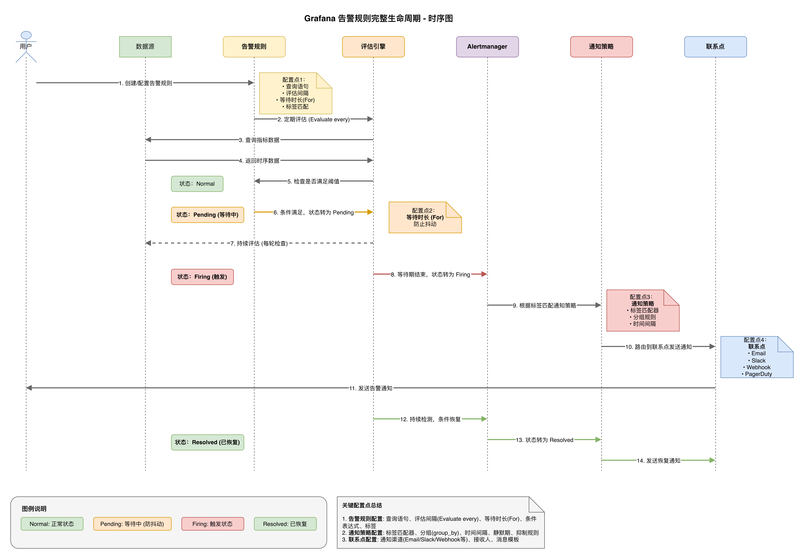
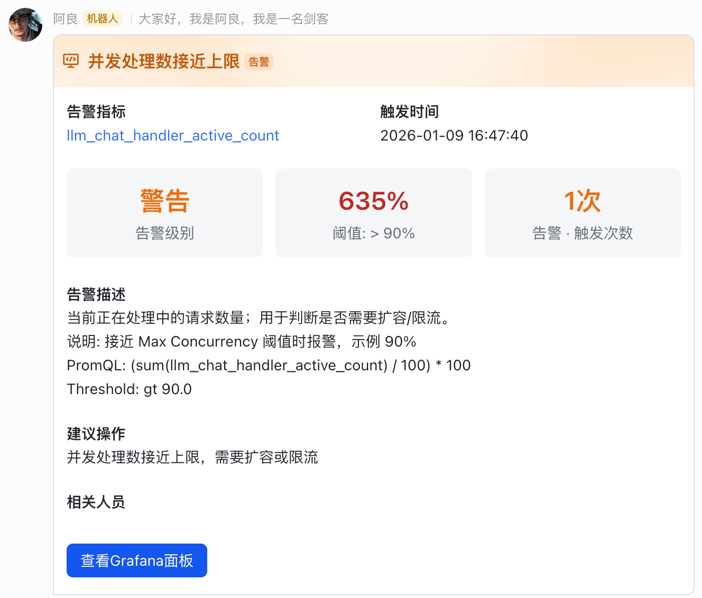
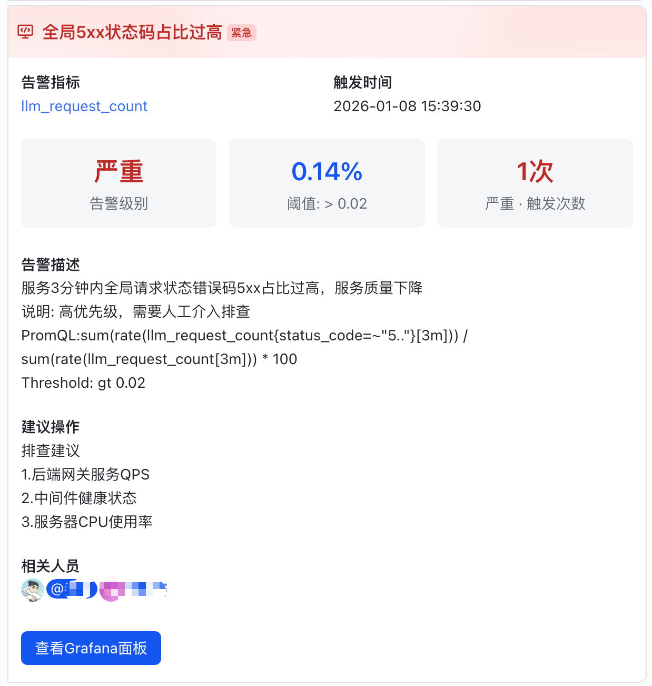
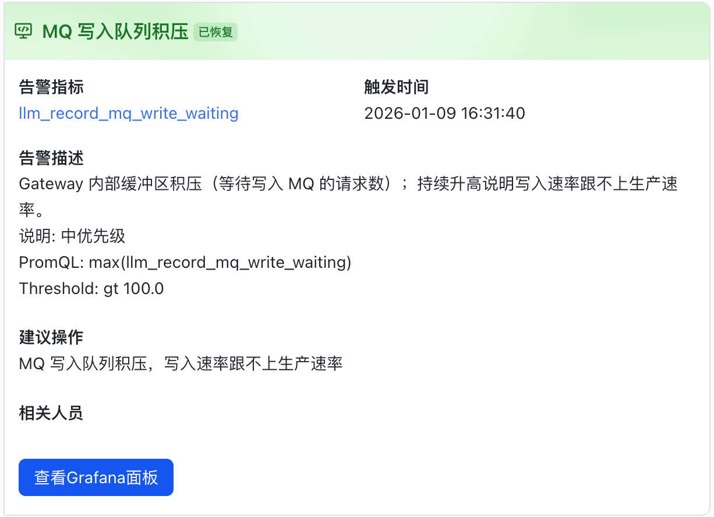

# Grafana 实践笔记

本项目主要用于学习 Grafana 的日常使用与查询语言相关内容（以 Prometheus 数据源的 PromQL 为主）。

BB几句，恃才傲物，文人相轻的事我们不要做，三人行，必有我师焉，谁都不可能是全知全能的神（大模型除外：））。


## 预览图










## 文档索引

- `promql.md`：PromQL（Grafana + Prometheus 最常用查询语言）从概念、关键字到常用函数与实战示例
- `docker-compose.yaml`：本地实验环境一键启动（Grafana + Prometheus，自动接入数据源与示例仪表盘）
- `condistion.md`：Grafana 告警条件（Is above/Is below 等）速查与场景举例
- `parameter.md`：Grafana 告警通知（如飞书卡片）模板变量示例
- `tutorial-alerting-provisioning.md`：按“文件挂载（Provisioning）”方式配置飞书 + Email 告警的可复现教程

## 推荐阅读顺序

1. 先理解怎么查数据：`promql.md`
2. 再理解怎么做告警：`metrc.md`
3. 最后查表与套模板：`condistion.md`、`parameter.md`

## 本地实验环境（Docker Compose 挂载文件版）

在本目录执行：

```bash
cp .env.example .env
docker compose -f docker-compose.yaml up -d
```

访问：

- Grafana：`http://localhost:10002`（用户名/密码：`admin` / `admin123`）
- Prometheus：`http://localhost:9090`

说明：

- Prometheus 会抓取 Prometheus/Grafana 自身的 `/metrics`，用于练习 CPU/内存相关查询与告警。
- Grafana 会自动配置 Prometheus 数据源，并预置一个示例仪表盘：`Local Lab: Prometheus & Grafana CPU/Memory`。

## 本地 mock 指标服务（用于触发告警）

- 指标服务：`mock_llm_metrics_server.py`（标准库实现 `/metrics`，会生成 `llm_*` 指标/labels/histogram）
- 启动脚本：`run-mock-metrics.sh`（默认 `stress` 模式，更容易触发阈值）
- Prometheus 抓取配置：`stack/prometheus/prometheus.yml`（job=`mock-llm` → `host.docker.internal:18080`）

使用方法（Grafana/Prometheus 已通过 docker-compose 启动的前提下）：

```bash
# 终端 1：启动 mock 指标服务
bash run-mock-metrics.sh

# 终端 2：重启 Prometheus 让 targets 立即刷新（可选）
docker compose -f docker-compose.yaml restart prometheus
```

验证：

- 打开 `http://localhost:9090/targets` 看 `mock-llm` 是否 UP
- 在 Prometheus/Grafana 直接查询 `llm_request_count`

若抓取失败：将 `stack/prometheus/prometheus.yml` 里的 `host.docker.internal` 改成你的宿主机 IP 再重启 Prometheus。

## 告警文件化（Provisioning）

统一告警（Alert Rules / Notification Policy / Contact Points / Notification Templates）均通过文件挂载配置：

- 入口目录：`stack/grafana/provisioning/alerting/`
- 说明：文件化配置的对象 `provenance=file`，在 Grafana UI 中通常是只读；修改请改文件并重启 Grafana 容器。


## 本地实验环境（Docker Compose 手动版）
起一个空的监控，自行参照规则然后添加监控

``` bash

# 终端 1：启动 mock 指标服务
bash run-mock-metrics.sh

# 纯净版演示
docker compose -f docker-compose-simple.yaml up -d

```


## 联系我

- 微信公众号：[码中悟道]
- GitHub: [5372604@qq.com]
- 邮箱: [5372604@qq.com]

---

**如果觉得有用，欢迎点赞、在看、分享！**